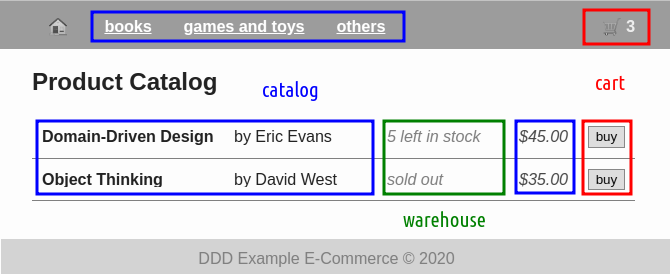

# DDD Example Project in Java: eCommerce (Microfrontend)

*Disclaimer:* This is an alternative branch, for more info please check out [master](https://github.com/ttulka/ddd-example-ecommerce).

The purpose of this project is to provide a sample implementation of an e-commerce product following **Domain-Driven Design (DDD)** and **Service-Oriented Architecture (SOA)** principles.

Programming language is Java with heavy use of Spring framework.

```sh
# build
mvn clean install

# run 
mvn spring-boot:run -f application/pom.xml

# open in browser http://localhost:8080
```

## About the Branch

This branch implement the idea of **Microfrontends**.

Components that belong logically to a particular service are included in codebase of that service.

Components are then used in a composite page (Portal):



### Implementation Notes

Service components are implemented as **Web Components** with no dependencies on addition JavaScript frameworks or libraries.

Composition is done in Portal's Page Controllers.

Communication is carried out via Message Bus (the `window` object) by sending events and commands.

Data is fetch only by controllers and pushed into the components.
