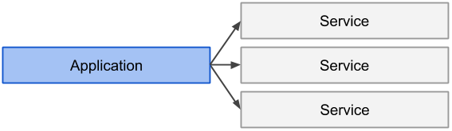
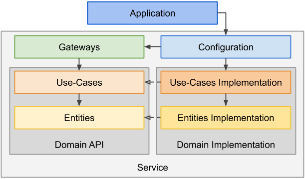
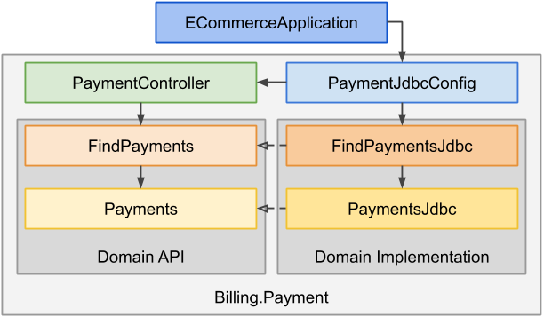

# DDD Example Project in Java: E-Commerce

The purpose of this project is to provide a sample implementation of an e-commerce product following **Domain-Driven Design (DDD)** and **Service-Oriented Architecture (SOA)** principles.

Programming language is Java 11 with heavy use of Spring framework.

```sh
# build
mvn clean install

# run 
mvn spring-boot:run

# open in browser http://localhost:8080
```

## Table of Contents

- [Domains](#domains)
  + [Core Domain](#core-domain)
  + [Supporting Subdomains](#supporting-subdomains)
  + [Event Workflow](#event-workflow)
  + [Services Dependencies](#services-dependencies)
- [Architectural Overview](#architectural-overview)
  + [Screaming Architecture](#screaming-architecture)
  + [Packaging](#packaging)
  + [Assembling](#assembling)
  + [Anatomy of a Service](#anatomy-of-a-service)

## Domains

Several [Business Capabilities][vcha] have been identified:

[vcha]: http://bill-poole.blogspot.com/2008/07/value-chain-analysis.html

### Core Domain

- **Sales**
  - put a product for sale
  - categorize a product
  - update a product
  - change a product price
  - validate an order
  - place an order
  
### Supporting Subdomains
  
- **Warehouse**
  - stack goods
  - fetch goods for shipping
  
- **Billing**
  - collect a payment

- **Shipping**
  - dispatch a delivery

Later, we can think about more supporting domains (not implemented in this project):

- **Marketing**
  - discount a product
  - promote a product
  
- **User Reviews**
  - add a product review
  
- **Customer Care**
  - resolve a complain
  - answer a question
  - provide help
  - loyalty program
  
The e-commerce system is a web application using a **Portal** component implementing the [Backends For Frontends (BFF)][bff] pattern.

[bff]: https://samnewman.io/patterns/architectural/bff/

### Event Workflow

The communication among domains is implemented via events:


When the customer places an order the following process starts up (the happy path):

1. Shipping prepares a new delivery.
1. Sales creates a new order and publishes the `OrderPlaced` event.
1. Shipping accepts the delivery.
1. Billing collects payment for the order and publishes the `PaymentCollected` event.
1. Warehouse fetches goods from the stock and publishes the `GoodsFetched` event.
1. Shipping dispatches the delivery and publishes the `DeliveryDispatched` event.
1. Warehouse updates the stock.

There is only the basic "happy path" workflow implemented with a big room for improvement, for example when Shipping doesn't get bot Events within a time period, the delivery process should be cancelled etc.. 

### Services Dependencies

Services cooperate together to work out the Business Capabilities: sale and deliver goods.

The actual dependencies come only from Listeners which fulfill the role of the Anti-Corruption Layer and depend only on Domain Events.


Events contain no Domain Objects. 

For communication across Services an Event Publisher abstraction is used, located in the package `..ecommerce.common.events`. The interface is an Output Port (in the Hexagonal Architecture) and as a cross-cutting concern is its implementation injected by the Application.  

## Architectural Overview

While no popular architecture ([Onion][onion], [Clean][clean], [Hexagonal][hexagonal], [Trinity][trinity]) was strictly implemented, the used architectural style follows principles and good practices found over all of them.
- Low coupling, high cohesion
- Implementation hiding
- Rich domain model
- Separation of concerns
- The Dependency Rule

The below proposed architecture tries to solve one problem often common for these architectural styles: [exposing internals of objects](https://blog.ttulka.com/object-oriented-design-vs-persistence) and breaking their encapsulation. The proposed architecture employs full object encapsulation and rejects anti-patterns like Anemic Domain Model or JavaBean. An Object is a solid unit of behavior. A Service is an Object on higher level of architectural abstraction. 

[onion]: http://jeffreypalermo.com/blog/the-onion-architecture-part-1
[clean]: https://blog.cleancoder.com/uncle-bob/2012/08/13/the-clean-architecture.html
[hexagonal]: https://alistair.cockburn.us/hexagonal-architecture/
[trinity]: https://github.com/oregor-projects/trinity-demo-java

### Screaming Architecture

The architecture "screams" its intentions just by looking at the code structure:
```
..ecommerce
    billing
        payment
    sales
        category
        order
        product
    shipping
        delivery
    warehouse
```

Going deeper the technical concepts are visible too:
```
..ecommerce
    billing
        payment
            jdbc
        listeners
        rest
```

### Packaging

As shown in the previous section, the code is structured by the domain together with packages for technical concerns (`jdbc`, `rest`, `web`, etc.).

Such a packaging style is the first step for a further modularization. 

The semantic of a package is following: `company.product.domain.service.[entity|impl]`, where `entity` and `impl` are optional. Full example: `com.ttulka.ecommerce.billing.payment.jdbc`. 

### Assembling

While a physically monolithic deployment is okay for most cases, a logically monolithic design, where everything is coupled with everything, is evil.

To show that the Monolith architectural pattern is not equal to the Big Ball Of Mud, a modular monolithic architecture was chosen as the start point.

The services can be further cut into separate modules (eg. Maven artifacts) by feature:
```
com.ttulka.ecommerce:ecommerce-application
com.ttulka.ecommerce.sales:catalog-service
com.ttulka.ecommerce.sales:cart-service
com.ttulka.ecommerce.sales:order-service
com.ttulka.ecommerce.billing:payment-service
com.ttulka.ecommerce.shipping:delivery-service
com.ttulka.ecommerce.warehouse:warehouse-service
```

Or by [component](https://blog.ttulka.com/package-by-component-with-clean-modules-in-java):
```
com.ttulka.ecommerce.billing:payment-domain
com.ttulka.ecommerce.billing:payment-jdbc
com.ttulka.ecommerce.billing:payment-rest
com.ttulka.ecommerce.billing:payment-events
com.ttulka.ecommerce.billing:payment-listeners
```

In detail:
```
com.ttulka.ecommerce.billing:payment-domain
    ..billing
        payment
            Payment
            PaymentId
            CollectPayment
            FindPayments
com.ttulka.ecommerce.billing:payment-jdbc
    ..billing.payment.jdbc
        PaymentJdbc
        CollectPaymentJdbc   
        FindPaymentsJdbc     
com.ttulka.ecommerce.billing:payment-rest
    ..billing.payment.rest
        PaymentController
com.ttulka.ecommerce.billing:payment-events
    ..billing.payment
        PaymentCollected
com.ttulka.ecommerce.billing:payment-listeners
    ..billing.payment.listeners
        OrderPlacedListener
```

Which can be brought together with a Spring Boot Starter, containing only Configuration classes and dependencies on other modules:
```
com.ttulka.ecommerce.billing:payment-spring-boot-starter
    ..billing.payment
        jdbc
            PaymentJdbcConfig
        listeners
            PaymentListenersConfig
    META-INF
        spring.factories
```

Note: Events are actually part of the domain, that's why they are in the package `..ecommerce.billing.payment` and not in `..ecommerce.billing.payment.events`. They are in a separate module to break the build cyclic dependencies: a dependent module (Listener) needs to know only Events and not the entire Domain. 

See this approach in an alternative brach: [modulith](https://github.com/ttulka/ddd-example-ecommerce/tree/modulith).

### Anatomy of a Service 

**[Service](http://udidahan.com/2010/11/15/the-known-unknowns-of-soa/)** is the technical authority for a specific business capability.
- There is a one-to-one mapping between a Bounded Context and a Subdomain (ideal case).
- A Bounded Context defines the boundaries of the biggest services possible.
- A Bounded Context can be decomposed into multiple service boundaries.
    - For example, Sales domain contains Catalog, Cart and Order services.
- A service boundaries are based on service responsibilities and behavior.
- A service is defined by its logical boundaries, not a physical deployment unit.

**Application** is a deployment unit. A monolithic Application can have more Services.
- Bootstrap (application container etc.). 
- Cross-cutting concerns (security, transactions, messaging, logging, etc.).



**Configuration** assemblies the Service as a single component.
- Has dependencies to all inner layers.
- Can be implemented by Spring's context `@Configuration` or simply by object composition and Dependency Injection.
- Implements the Dependency Inversion Principle.  

**Gateways** create the published API of the Service.
 - Driving Adapters in the Hexagonal Architecture.
 - REST, SOAP, or web Controllers,
 - Event Listeners,
 - CLI.
 
**Use-Cases** are entry points to the service capabilities and together with **Entities** form the _Domain API_.
- Ports in the Hexagonal Architecture.
- No implementation details.
- None or minimal dependencies.
 
_Domain Implementation_ fulfills the Business Capabilities with particular technologies.
- Driven Adapters in the Hexagonal Architecture.
- Tools and libraries,
- persistence,
- external interfaces access.

Source code dependencies point always inwards and, except Configuration, are strict: allows coupling only to the one layer below it (for example, Gateways mustn't call Entities directly, etc.).
 


#### Example of a Service Anatomy 

As a concrete example consider the Business Capability to find payments in Billing service:

- Application is implemented via Spring Boot Application.
- `PaymentJdbcConfig` configures the JDBC implementations for the Domain. 
- Gateway is implemented as a REST Controller.
- Use-Case interface  `FindPayments` is implemented with `PaymentsJdbc` in Use-Cases Implementation.  
- Entity `Payment` is implemented with `PaymentJdbc` in Entities Implementation.



There is no arrow from Configuration to Gateways because `PaymentController` is annotated with Spring's `@Component` which makes it available for component scanning the application is based on. This is only one possible approach. Another option would be to put the Controller as a Bean into the Configuration, etc..  
